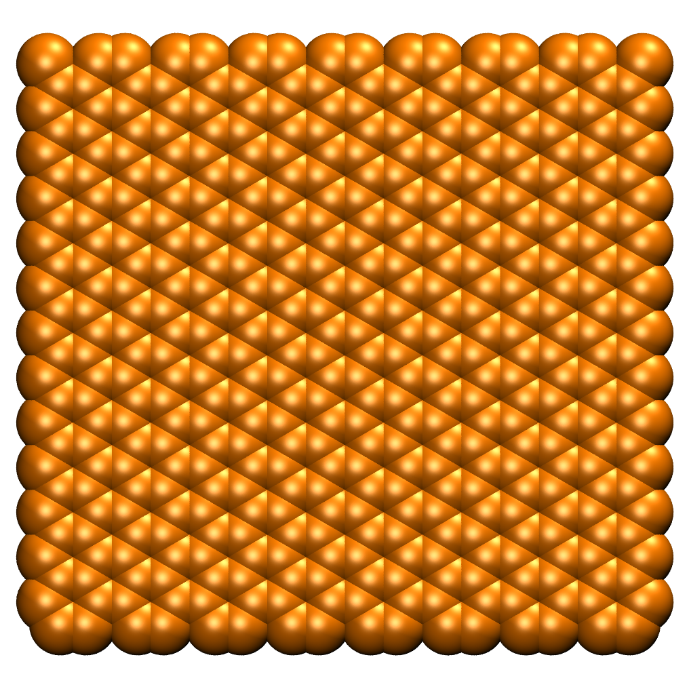
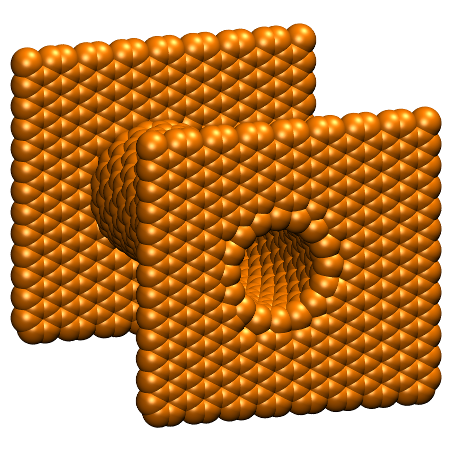
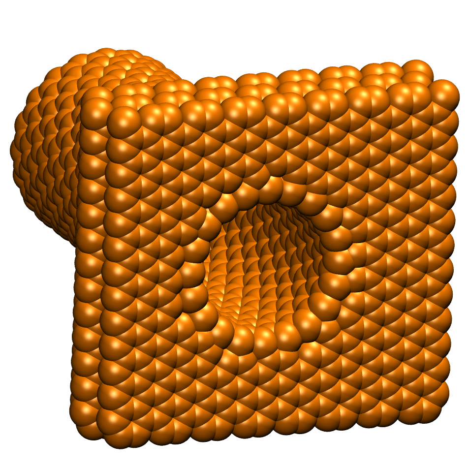

Nano structures
=================

This mode is automatically started, when the '-c' flag is given while starting the program.

.. code-block:: none

    $ python3.8 CONAn.py -c

The mode is used to build new carbon and boron nitride structures from scratch and print the xyz structures to a file.

The program is able to build the following structures:

* Carbon nanotubes (CNTs) and boron nitride nanotubes of arbitary length and radius in zigzag and armchair conformation.
* Walls of arbitary size in x and y direction. Multiple layers can be constructed in ABA layering.
* The CNTs and carbon walls can be combined to build a 'pore' structure. Either as an open tube with walls on either side, or closed on one side, having a wall on one the other side.
* Carbon structures can be doped with graphitic nitrogen as needed.
* All structures are set up in such a way, that periodic boundary conditions are satisfied.

.. image:: ../pictures/CNT.png
   :width: 24%
   :alt: CNT

The structures are built by using the following default parameters:

* Carbon-carbon distance is 1.42 Angstrom.
* Interlayer distance between carbon layers is set to 3.35 Angstrom.
  The layers are shifted with respect to each other, resulting in an ABA stacking.
* Boron-nitride distance is 1.44 Angstrom.
* Interlayer distance between boron nitride layers is set to 3.33 Angstrom.
  The positions of all nitrogen and boron atoms are switched in consecutive layers, resulting in an ABA stacking.

All set values can be freely adjusted by the user.
All relevant quantities are printed to the terminal and the ``conan.log`` file, the xyz structures are written to a seperate file.

